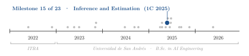
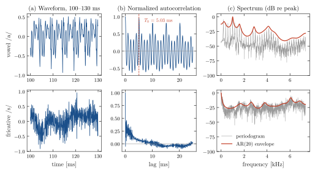
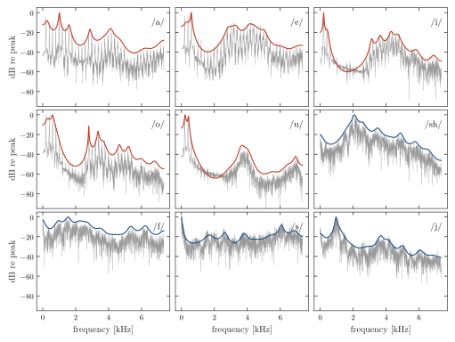
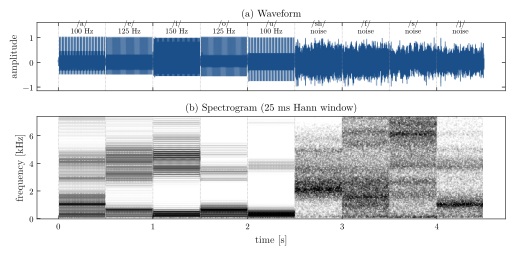

<div align="center">

# Analysis and Synthesis of Spanish Phonemes with AR(20) Source–Filter Models

**Santiago Groba Alonso** · [Francisco Carruthers](https://github.com/FranciscoCarruthers)

Universidad de San Andrés · *Inference and Estimation* · First semester 2025 · Assignment 2

[](#reproducing-the-results)
[](#reproducing-the-results)

<picture>
  <source media="(prefers-color-scheme: dark)" srcset="docs/figures/trajectory-dark.svg">
  
</picture>

</div>

> **Abstract.** Speech can be modelled as an excitation passed through an all-pole filter: a periodic pulse train for voiced sounds, white noise for fricatives. Given recordings of nine Spanish phonemes (*a, e, i, o, u, sh, f, s, j*) and an autoregressive model of order 20 for each, we compare 200 ms of every recording with its model, through the normalized autocorrelation and the periodogram, and then synthesize the phonemes by filtering the corresponding excitation. The autocorrelation separates the two classes cleanly: the five vowels have a peak of 0.84–0.97 at a lag of 5.03 ms (a pitch of 199 Hz), while no fricative exceeds 0.34. The AR spectrum follows the envelope of the periodogram for all nine phonemes and every filter is stable (largest pole radius 0.996). Concatenating the synthesized phonemes, with a fixed 200 Hz pitch or a different pitch per vowel, keeps the vowel/fricative distinction audible, but the result sounds clearly artificial.

---

## 1. Problem

The assignment provides one recording per phoneme (14.7 kHz, 16 bit, 0.45 s) and, in `data.py`, the coefficients $a_1, \dots, a_{20}$ and gain $G$ of an AR model for each phoneme,

$$x[n] = \sum_{k=1}^{20} a_k\, x[n-k] + G\, u[n], \qquad S_x(f) = G^2\, \frac{S_u(f)}{\left|1 - \sum_{k=1}^{20} a_k e^{-j 2\pi f k / f_s}\right|^2},$$

with $u[n]$ a pulse train of fundamental frequency $f_0$ for vowels and unit-variance white noise for fricatives.

1. **Analysis.** For 200 ms of each recording, plot the signal, its normalized autocorrelation, and its periodogram against the PSD $S_x(f)$ of the model.
2. **Synthesis.** Generate 500 ms of each phoneme from the model, concatenate the nine phonemes with a pitch of 200 Hz, and again with a different pitch per vowel, and listen to the result.

## 2. Methods

| Component | Choice |
|---|---|
| Analysis window | First 200 ms (2940 samples) of each recording, scaled to a peak of 1 |
| Autocorrelation | `np.correlate` over the whole window, divided by its value at lag 0 |
| Periodogram | $\lvert \mathrm{FFT}\{x\}\rvert^2 / N$ on $[0, f_s/2]$, in dB |
| Model PSD | $\lvert H(f)\rvert^2$ from `scipy.signal.freqz(b, [1, -a1, ..., -a20])` with `b` $= G$, times the periodogram of a 200 Hz pulse train for vowels; both curves shifted to a 0 dB peak |
| Excitation | Pulse train with $\sqrt{f_s/f_0}$ amplitude (unit power) for vowels; Gaussian white noise for fricatives |
| Synthesis | `scipy.signal.lfilter(b, a, u)`, 500 ms per phoneme, 5 ms Hamming fade at both ends, peak normalization |
| Sequences | 200 Hz for every vowel; then /a/ 100, /e/ 125, /i/ 150, /o/ 125, /u/ 100 Hz |

According to the commit history, Exercise 1 (`Ej1.py`) was written mainly by Santiago and Exercise 2 (`Ej2.py`) mainly by Francisco; the report was written together.

## 3. Results

### 3.1 Recordings against the model

<p align="center"></p>

**Figure 1.** A vowel and a fricative. (a) 30 ms of the recording. (b) Normalized autocorrelation: /a/ repeats every $T_0 = 5.03$ ms, while /s/ falls to about 0.3 after the first lag and has no periodic peaks. (c) Periodogram (gray) and AR envelope $G^2 \lvert H(f)\rvert^2$ (red), aligned at their peaks. The harmonics of /a/ are spaced 199 Hz apart and the envelope passes over them; for /s/ the envelope follows the broadband noise.

**Table 1.** Voicing and stability per phoneme, computed by `docs/figures/make_figures.py`. $\rho^*$ is the largest normalized autocorrelation for lags between 2.5 and 16.7 ms (pitches of 60 to 400 Hz), and $f_0$ the pitch implied by that lag.

| Phoneme | Excitation | $\rho^*$ | $f_0$ [Hz] | Largest pole radius |
|---|---|---:|---:|---:|
| /a/ | pulses | 0.96 | 199 | 0.988 |
| /e/ | pulses | 0.84 | 199 | 0.989 |
| /i/ | pulses | 0.88 | 199 | 0.994 |
| /o/ | pulses | 0.97 | 199 | 0.996 |
| /u/ | pulses | 0.97 | 199 | 0.990 |
| /sh/ | noise | 0.25 | – | 0.958 |
| /f/ | noise | 0.15 | – | 0.955 |
| /s/ | noise | 0.27 | – | 0.991 |
| /j/ | noise | 0.34 | – | 0.979 |

<p align="center"></p>

**Figure 2.** Periodogram (gray) and AR(20) envelope for the five vowels (red) and the four fricatives (blue). The envelope tracks the resonances of every phoneme: the low and high bands of /i/ and /u/ with a deep valley between them, the two close low resonances of /o/, the broad peak of /sh/ near 2 kHz and the peak of /j/ near 1 kHz. It does not reproduce the fine structure: the harmonics of the vowels and the random fluctuation of the noise periodograms.

### 3.2 Synthesis

<p align="center"></p>

**Figure 3.** The second sequence of `Ej2.py`: nine synthesized phonemes of 500 ms with a different pitch per vowel. (a) Waveform, each phoneme normalized to a peak of 1. (b) Spectrogram: the vowels show horizontal harmonics whose spacing follows the pitch (100 to 150 Hz) under the formant bands of Figure 2, while the fricatives are noise shaped by their envelopes.

In the report's listening test, the synthesized sequences keep the difference between vowels and fricatives and the change of pitch, but sound artificial; the per-phoneme normalization also makes loudness jump between segments.

## 4. Takeaways

- Twenty coefficients are enough to capture the spectral envelope of a phoneme; what makes it a vowel or a fricative is the excitation, and the autocorrelation at the pitch lag tells the two apart at a glance.
- The periodogram is a noisy estimate (its fluctuations do not shrink with a longer window), so a smooth parametric spectrum is the more useful description of the vocal tract.
- Natural-sounding speech needs more than a static filter per phoneme: transitions between phonemes, a varying pitch and amplitude, and a glottal pulse shape are all missing from this model.

## Reproducing the results

```bash
pip install numpy scipy matplotlib sounddevice soundfile
python Ej1.py                        # panels of Exercise 1 in output/ej1/
python Ej2.py                        # plays both sequences, figures in output/ej2/ (needs an audio device)
python docs/figures/make_figures.py  # figures of this README and Table 1 (no audio needed)
```

| File | Content |
|---|---|
| `Ej1.py` | Exercise 1: signal, autocorrelation, periodogram and model PSD for each phoneme |
| `Ej2.py` | Exercise 2: synthesis, concatenation with fixed and variable pitch, playback |
| `data.py` | AR coefficients and gains, pulse-train generator, edge fade, playback helper (provided with the assignment) |
| `a.wav` … `u.wav` | Recordings of the nine phonemes (provided with the assignment) |
| `output/` | Figures produced by `Ej1.py` and `Ej2.py`, used in the report |
| `TP2_G03.pdf` | Report (Spanish) |
| `docs/figures/` | Script and style used for the figures in this README |

## Citation

```bibtex
@misc{groba2025phonemes,
  author       = {Groba Alonso, Santiago and Carruthers, Francisco},
  title        = {Analysis and Synthesis of Spanish Phonemes with {AR}(20) Source--Filter Models},
  year         = {2025},
  howpublished = {Universidad de San Andr{\'e}s, Inference and Estimation},
  url          = {https://github.com/Santi2065/ar-phoneme-synthesis}
}
```
